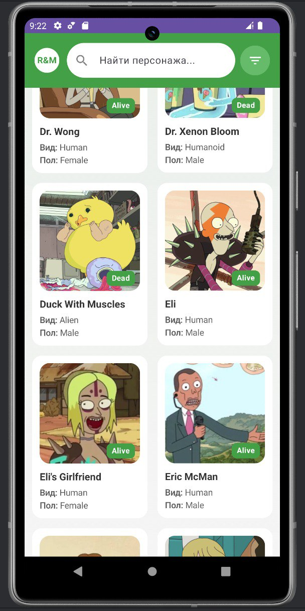

# Rick and Morty Character Explorer

## Общее описание
Приложение для поиска и фильтрации персонажей из вселенной "Рик и Морти" с использованием [The Rick and Morty API](https://rickandmortyapi.com). Приложение предоставляет:

- Просмотр списка персонажей с пагинацией
- Поиск по имени
- Расширенную фильтрацию по параметрам
- Просмотр детальной информации о персонажах
- Работу в офлайн-режиме

## Скриншоты

### Главный экран


### Экран фильтров


### Детали персонажа


## Технологический стек
- **Язык**: Kotlin
- **UI**: Jetpack Compose
- **Архитектура**: MVVM
- **DI**: Hilt
- **Сетевое взаимодействие**: Retrofit + Gson
- **Локальное хранилище**: Room
- **Асинхронность**: Kotlin Coroutines
- **Загрузка изображений**: Coil
- **Навигация**: Compose Navigation
- **Pull-to-Refresh**: Accompanist

## Архитектура
Проект следует принципам чистой архитектуры с разделением на слои:

### Слой данных (data)
- **api**: Интерфейсы Retrofit (`RickAndMortyApi`)
- **local**: 
  - DAO (`CharacterDao`, `CharacterDetailDao`)
  - База данных (`AppDatabase`)
  - Сущности (`CharacterEntity`, `CharacterDetailEntity`)
- **network**: Утилиты сети (`Connectivity`)
- **repository**: Реализация репозитория (`CharacterRepository`)

### Слой домена (domain)
- **model**: 
  - Модели данных (`CharacterItem`, `CharacterDetail`, `CharacterResponse`)
  - Модель фильтров (`CharacterFilters`)

### Слой представления (presentation)
- **navigation**: Маршруты (`NavRoutes`)
- **screens**: Экранны (`HomeScreen`, `FiltersScreen`, `CharacterDetailsScreen`)
- **ui**: Темы и стили (`Theme`, `Shapes`, `Type`)
- **viewmodel**: ViewModels (`HomeViewModel`, `FiltersViewModel`, `CharacterDetailsViewModel`)

## Ключевые особенности реализации

### Фильтрация персонажей
```kotlin
// Формирование запроса с фильтрами
api.getCharacters(
    page = page,
    name = name?.takeIf { it.isNotEmpty() },
    status = status?.takeIf { it.isNotEmpty() },
    // ...
)

// Офлайн-фильтрация в Room
@Query("""
    SELECT * FROM characters 
    WHERE (:name IS NULL OR :name = '' OR name LIKE '%' || :name || '%')
    AND (:status IS NULL OR :status = '' OR status = :status)
    // ...
""")
suspend fun filterCharacters(...): List<CharacterEntity>
```

### Пагинация с кэшированием
- Подгрузка данных постранично
- Кэширование страниц в Room
- Удаление устаревших страниц при обновлении
- Индикаторы загрузки и кнопка "Загрузить еще"

### Офлайн-режим
```kotlin
// Проверка подключения
fun isConnected(): Boolean {
    val connectivityManager = context.getSystemService(Context.CONNECTIVITY_SERVICE) as ConnectivityManager
    // ...
}

// Стратегия загрузки
if (connectivity.isConnected()) {
    // Загрузка из сети
    val response = api.getCharacters(...)
    // Кэширование
    characterDao.insertAll(response.results.map { it.toCharacterEntity(page) })
} else {
    // Загрузка из кэша
    val cached = characterDao.getCharactersByPage(page)
}
```

### Валидация фильтров
```kotlin
// Проверка допустимых значений
statusError = viewModel.status.isNotEmpty() && viewModel.status !in listOf("Alive", "Dead", "Unknown")
genderError = viewModel.gender.isNotEmpty() && viewModel.gender !in listOf("Female", "Male", "Genderless", "Unknown")

// Отображение ошибок
if (statusError) {
    Text("Недопустимое значение статуса", color = MaterialTheme.colorScheme.error)
}
```

### Навигация с параметрами
```kotlin
// Формирование URL с параметрами фильтров
val queryParams = listOfNotNull(
    "searchQuery=${viewModel.name.urlEncoded()}",
    viewModel.status.takeIf { it.isNotEmpty() }?.let { "status=${it.urlEncoded()}" },
    // ...
).joinToString("&")

navController.navigate("${NavRoutes.HOME}?$queryParams")
```

## Сборка и запуск
1. Клонировать репозиторий:
   ```bash
   git clone https://github.com/your-username/rick-and-morty-app.git
   ```
3. Открыть проект в Android Studio
4. Собрать проект:
   ```bash
   ./gradlew assembleDebug
   ```
6. Запустить на эмуляторе или физическом устройстве

## Зависимости
Основные зависимости:
```gradle
// Compose
implementation(libs.androidx.compose.ui)
implementation(libs.androidx.compose.material3)

// DI
implementation(libs.google.hilt.android)
kapt(libs.google.hilt.android.compiler)

// Networking
implementation("com.squareup.retrofit2:retrofit:2.9.0")
implementation("com.squareup.retrofit2:converter-gson:2.9.0")

// Database
implementation("androidx.room:room-runtime:2.6.1")
kapt("androidx.room:room-compiler:2.6.1")

// Image loading
implementation("io.coil-kt:coil-compose:2.6.0")
```
## Планы по улучшению
1. Тестирования:
  - Unit-тесты для ViewModels
  - Интеграционные тесты для репозитория
  - UI-тесты для Composables
2. Дополнительные функции:
  - Избранные персонажи
  - История просмотров
  - Локации и эпизоды
